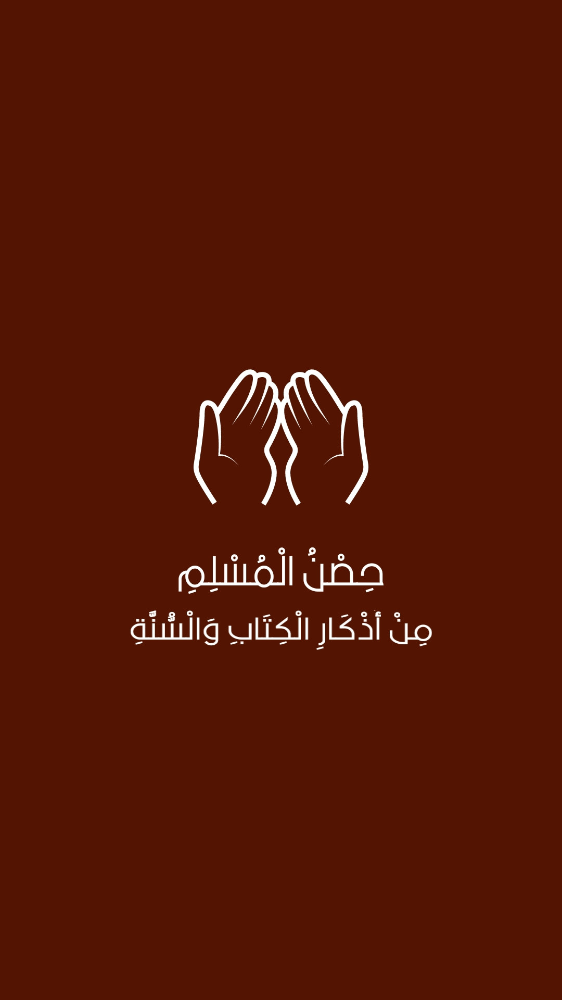
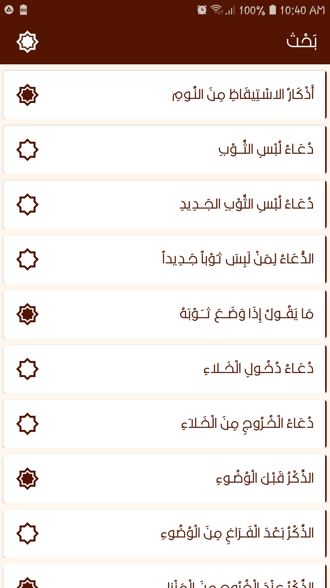
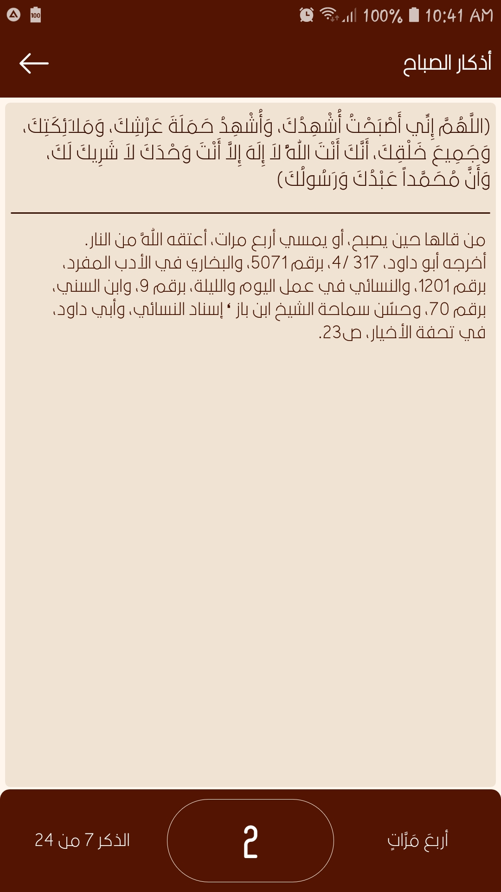
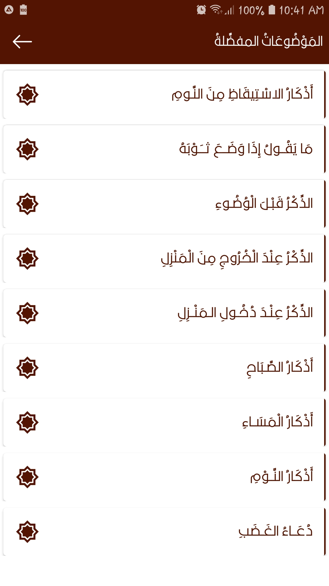
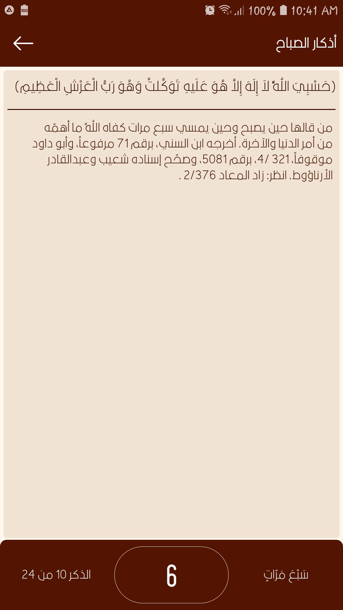
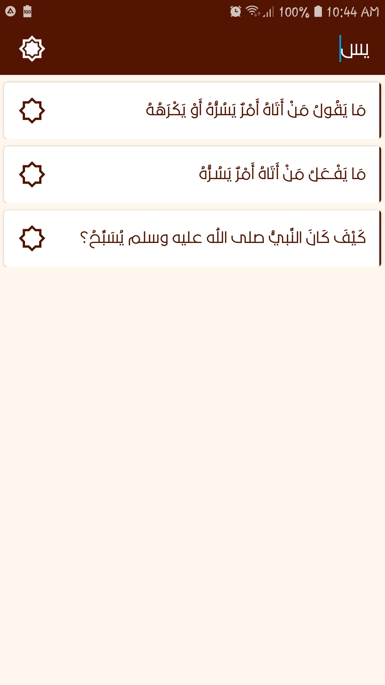
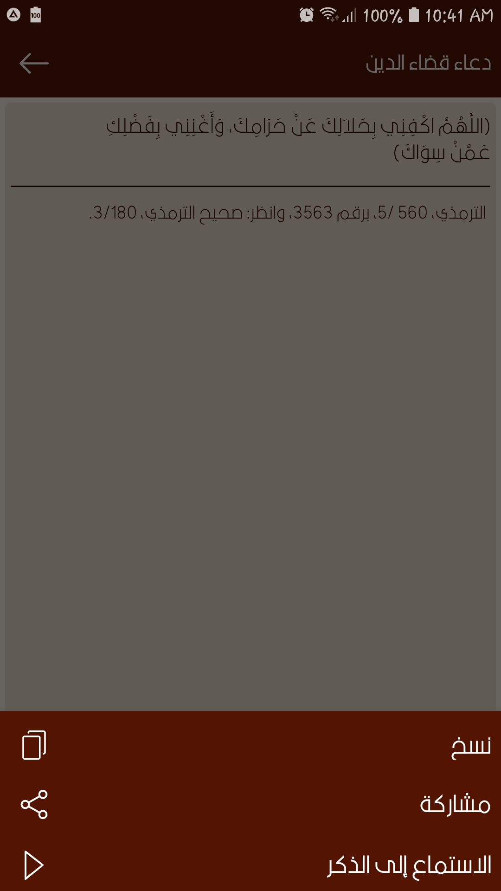
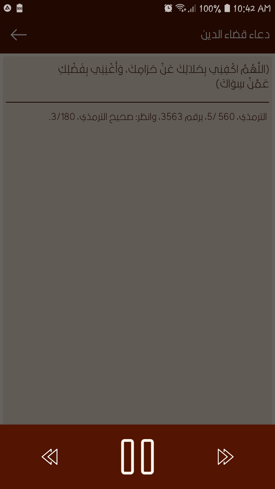
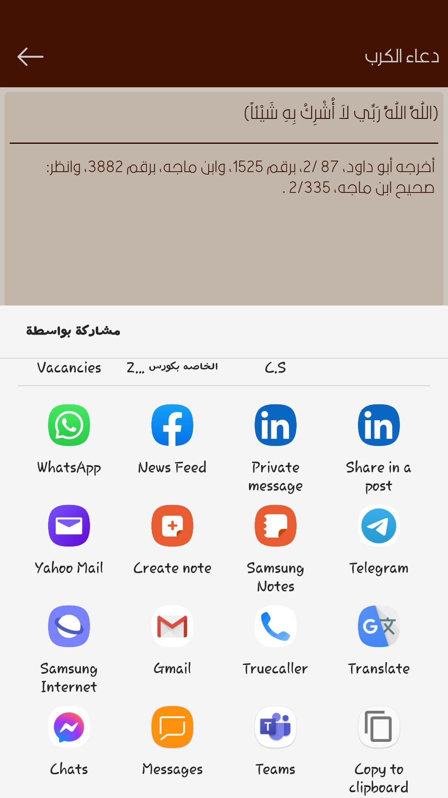

# HesnAl-Muslim
HesnAl-Muslim is an android application that contains all Athkar in the famous book "Hesn Al-Muslim" in the same order, and with new features like listening to athkar and more.

# Features:
It shows all athkar in the main activity.  
It allows to search in that list.  
It allows to add thekr to favorite or remove from it.  
Each category of athkar has its own place to be shown.  
Each thekr has its details like who did report the speech, how many times to say the thekr...  
Each thekr has a counter to keep track of your progress, and to switch to the next thekr automatically with a vibration.  
The ability to copy athkar to clipboard.  
The ability to share athkar with other applications like whatsapp, facebook, notes, and more.  
The ability to listen to each thekr online, pause, and resume it, also speed it and also slow it down.  

# Tech. used:
Java  
Kotlin a little bit  
Room persistence library  
Gson  
Exo player  

# Screen shots:

 

 

 

 

 

 

 

 

 

